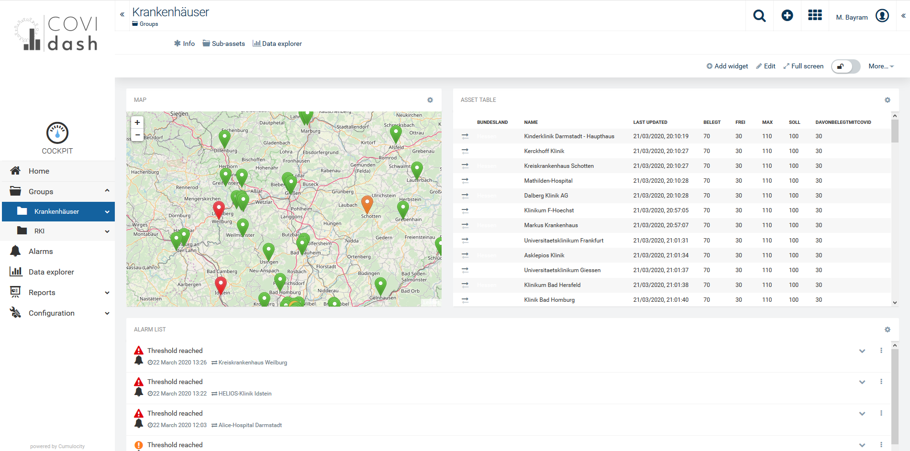

# CoviDash - Create real-time hospital capacity planning tool
Get full visibility of available hospital capacity with “CoviDash”. The Corona crisis is developing rapidly. In addition to the communication of case numbers, it is
crucial to have an up-to-date overview of the available hospital capacity at all times. On this basis,
the situation can be assessed, and the right decisions can be made to save lives.

## Situation
Currently, many countries do not have a central system for registering and evaluating hospital bed capacity. This is
especially the case for hospital beds with specific COVID-19 treatment options such as ventilation. In some countries,
both local and central registration systems exist and must be maintained in parallel, which is error-prone and causes
additional administrative burden.

## Response
Software AG created CoviDash as part of a German government hackathon initiated to spark innovative solutions to address the
crisis. It was developed in two days, showing that the selected products are very suitable for creating a mature solution when
time is of the essence. CoviDash consists of an integration component and a dashboard
component. The integration component collects and aggregates data that is distributed in a variety of source systems. The
dashboard component visualizes the data in various formats, including tabular and map views. It also provides various
aggregation levels, e.g. on Country level and on EU level. CoviDash is based on an open and expandable data model. As
quickly as it was created, it can be adopted for local needs. If required data is not available in existing source systems, a third
component for data entry can be added to CoviDash with little effort.

## Benefits

1. Visibility of crucial Covid-19 hospital resources based on a predefined, expandable dashboard supporting various visualizations (maps etc.) and aggregation levels.
2. Elimination of redundant administrative work. Only data that is currently not registered needs to be entered.
3. Quick connectivity to source systems with technical interfaces of different type and maturity (“from files to APIs”)
4. Free code, free hosting during thepandemic. Compliance to EU data protection standards (DSGVO/GDPR conformity) is possible, subject to confirmation based on source system location and other factors.

##  webMethods Integration Server

Integration Server is the run-time server whose primary function is to execute services. Integration Server does the following:

1. Receives requests from client applications and authenticates and authorizes the requesting users.
2. Invokes the appropriate services and passes them input data from the requesting clients.
3. May apply orchestration logic, transform the data, and invoke other services as part of executing a service.
4. Receives output data from the services and returns it to the clients.

Integration Server supports a wide range of established and emerging standards
so you can interact with virtually any business partner that is connected to the
Internet Integration Server hosts packages that contain services and related files,
such as specifications, document types, triggers, and dynamic server pages (DSPs).
Integration Server comes with built-in services and integration recipes, and
developers can create their own packages to hold services they create.
Services can be developed in FLOW, Java, and .Net. Many of the core products in
the webMethods suite—API Gateway, Trading Networks, even webMethods.io
Integration—run on top of or are based on Integration Server.

## Cumulocity IoT

Cumulocity IoT Platform is designed for Internet-of-Things (IoT)/Machine-to-
Machine (M2M) solutions. An IoT/M2M solution enables an end-user, for example
an enterprise customer, to manage and control remote assets that are equipped
with sensors (such as GPS devices, electricity meters and humidity sensors)
and actuators (such as switches and valves). In addition, real time data analytics
is used to implement business rules for specific application use cases. The
platform has been designed right from the beginning as cloud software. One
of the key advantages for end users is that they do not have to provide own,
dedicated computing resources for their IoT/M2M solution. Cloud also means no
or significantly lower up-front investments, and very fast deployment. The platform
is offered as fully managed service and accessible through common Internet
browsers on computers, tablets or smart phones.

More information on Cumulocity IoT and how to start a free trial can be found [here](https://www.softwareag.cloud/site/product/cumulocity-iot.html#/).

Cumulocity IoT enables companies to to quickly and easily implement smart IoT solutions.

______________________
For more information regarding Cumulocity you can Ask a Question in the [TECHcommunity Forums](http://tech.forums.softwareag.com/techjforum/forums/list.page?product=cumulocity).

For more information regarding webMethods you can Ask a Question in the [TECHcommunity Forums](http://tech.forums.softwareag.com/techjforum/forums/list.page?product=webmethods-io-b2b).

You can find additional information on webMethods in the [Software AG TECHcommunity](http://techcommunity.softwareag.com/home/-/product/name/webmethods-io-b2b).

You can find additional information on Cumulocity in the [Software AG TECHcommunity](http://techcommunity.softwareag.com/home/-/product/name/cumulocity).
______________________

These tools are provided as-is and without warranty or support. They do not constitute part of the Software AG product suite. Users are free to use, fork and modify them, subject to the license agreement. While Software AG welcomes contributions, we cannot guarantee to include every contribution in the master project.

Contact us at [TECHcommunity](mailto:technologycommunity@softwareag.com?subject=Github/SoftwareAG) if you have any questions.
